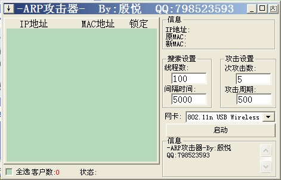
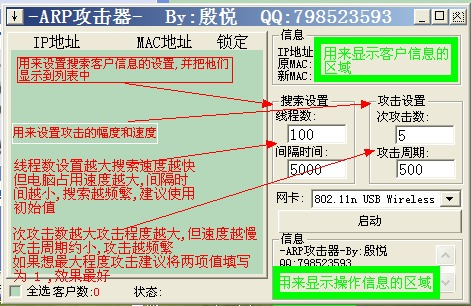
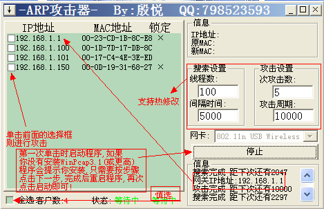
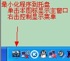
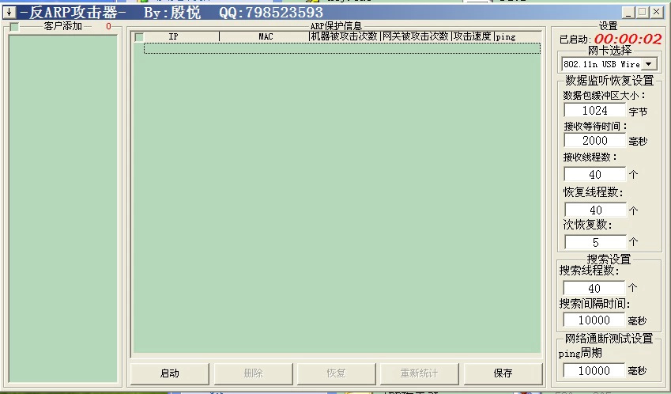
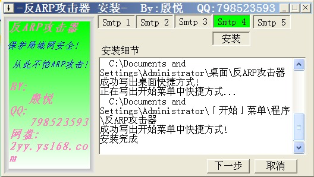
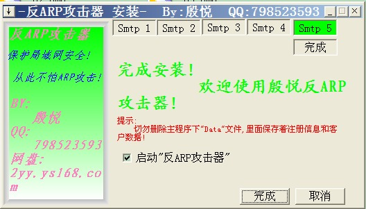
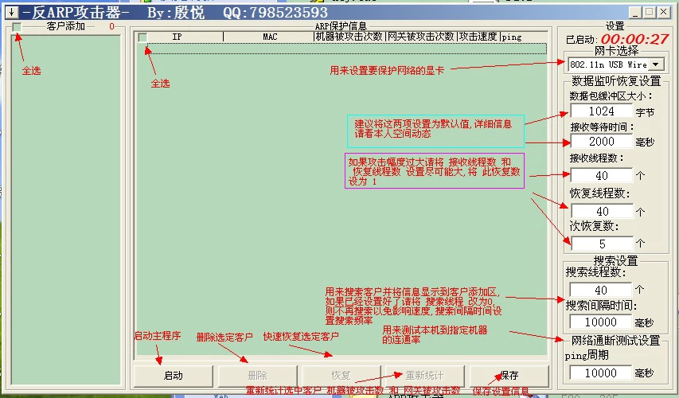
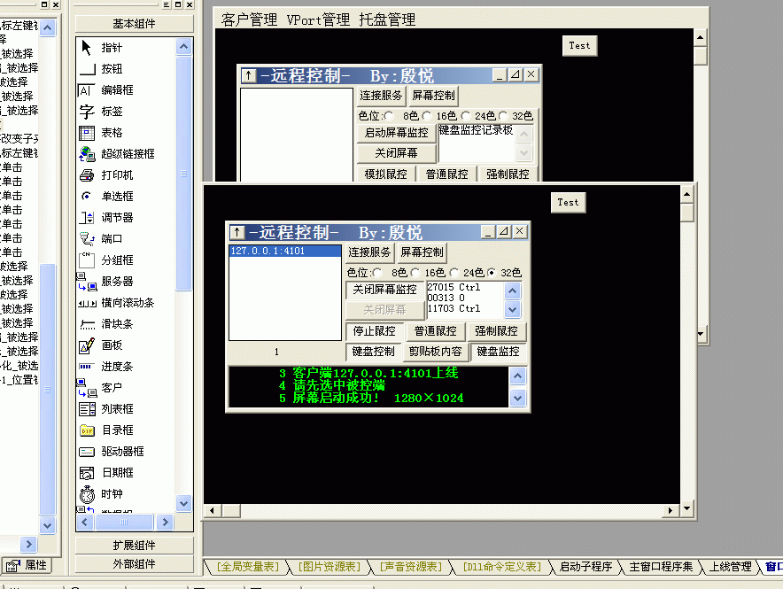
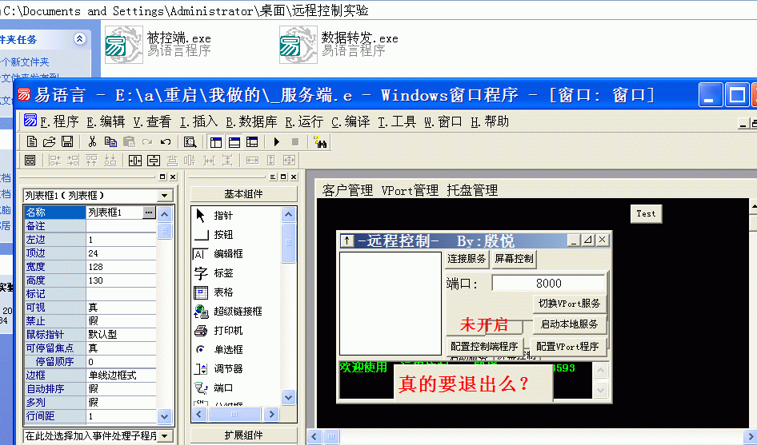

# e-language
## 说明

```
这些程序是2012年上初三的时候写的一些小程序，由易语言编写
作者:殷悦 联系方式: QQ:798523593
```

## 介绍
|名称|说明|完成日期|
|---|---|---|
|ARP_Attack|多线程扫描内网机器并可选择性进行ARP攻击|2012-5-19|
|ARP_Protect-V1.0|简单的ARP防护工具|2012-5-13|
|ARP_Protect-V2.0|多线程扫描内网机器并可选择性ARP防护|2012-6-29|
|ARP_Protect-install|ARP防护安装|2012-6-28|
|ARP_Protect-register|ARP注册机|2012-6-28|
|RemoteControl_Client|TCP远程控制客户端(屏幕差异传送)|2012-2-24|
|RemoteControl_Server|TCP远程控制服务端(屏幕差异传送)|2012-2-25|
|RemoteControl_Proxy|TCP远程控制代理服务|2012-2-24|
|SYN_Attack|简单的SYN攻击器|2012-6-2|

## 程序截图


##### ARP_Attack主界面

##### ARP_Attack程序功能介绍

##### ARP_Attack程序功能介绍

##### ARP_Attack任务栏图标

##### ARP_Protect程序主界面

##### ARP_Protect程序安装界面

##### ARP_Protect程序安装界面

##### ARP_Protect程序功能图

##### ARP_Protect任务栏图标

##### RemoteControl程序界面

##### RemoteControl程序界面



## 声明

```
整理日期 2018-4-24 时隔6年,我已大三
这些程序不再提供维护和更新
本程序使用GPL开源协议
如果转载，请注明出处
谢谢
```
